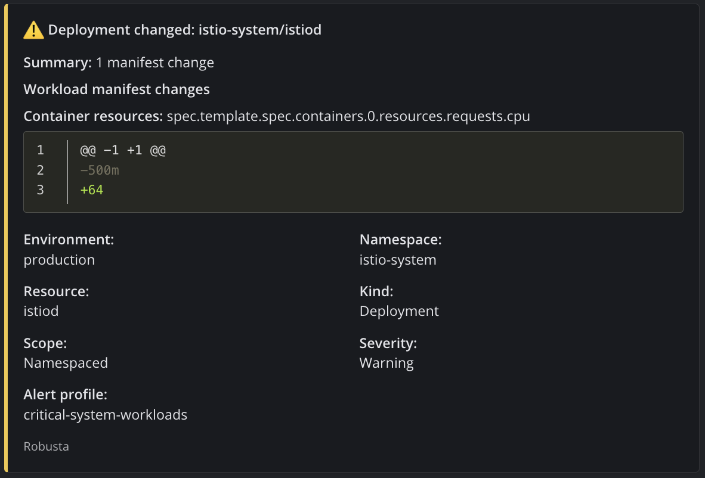
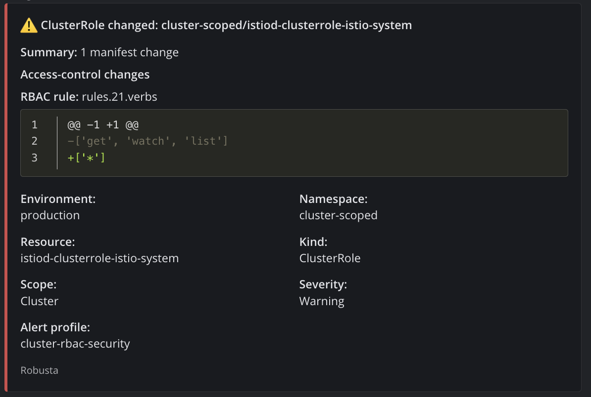

# UDS Robusta Package

This package watches supported Kubernetes resources for changes and sends formatted alerts to external webhook destinations. You choose the exact namespaces, resource types, and destinations through package-defined alert rules; the package owns the Robusta playbooks, routing, formatting, and Secret redaction.

Mattermost and Slack incoming webhooks are supported. A Robusta SaaS account, UI, Prometheus stack, or custom Robusta playbooks are not required.

## Core concepts

| Term | What it means |
| --- | --- |
| **Namespaced alert rule** | A package-defined rule that selects exact namespaces and Kubernetes resource types to alert on. |
| **Cluster alert rule** | A package-defined rule for cluster-scoped resources, such as Nodes and ClusterRoles, which do not belong to a namespace. |
| **Sink** | A logical destination name, such as `alerts-default`. Rules send alerts to sink names instead of containing webhook URLs. |
| **Destination type** | The receiver's payload format: `mattermost` or `slack`. Mattermost is the default. |
| **Webhook Secret** | The external `robusta-alert-webhooks` Kubernetes Secret that stores destination URLs. Each sink maps to one key in this Secret. |
| **Alert relay** | The package component that matches rules, redacts sensitive data, formats alerts, and sends them to each sink. |
| **`ALERT_CONFIG`** | Optional JSON containing custom alert rules and sink mappings. Omit it to use the package defaults. |

In short: an **alert rule** decides what should alert, a **sink** names where it should go, and the sink's **Secret key** provides the webhook URL.

> [!WARNING]
> **Package design note**
>
> Defense Unicorns engineers designed alert rules for this package to make Robusta easier to configure. Alert rules are not an upstream Robusta feature; they provide a simpler policy layer over Robusta playbooks, triggers, and sinks. Users declare what to watch and where to send it; the package translates resource events into normalized findings and applies those rules before external delivery.

## Quick start

### Prerequisites

- A Kubernetes cluster with UDS Core installed.
- A Mattermost or Slack incoming webhook reachable from the cluster over HTTPS (`443`).
- A released `zarf-package-robusta-...-upstream.tar.zst` package.

### 1. Create the webhook Secret

Webhook URLs stay in an externally managed Kubernetes Secret and are never stored in `ALERT_CONFIG`.

The default destination uses Mattermost formatting and reads the `alerts-default-url` key:

```bash
kubectl create namespace robusta --dry-run=client -o yaml | kubectl apply -f -

kubectl -n robusta create secret generic robusta-alert-webhooks \
  --from-literal=alerts-default-url='https://mattermost.example/hooks/REPLACE_ME' \
  --dry-run=client -o yaml | kubectl apply -f -
```

### 2. Deploy with the defaults

No custom alert rules are required for the default behavior.

```bash
PACKAGE=zarf-package-robusta-amd64-<version>-upstream.tar.zst

uds zarf package deploy "$PACKAGE" \
  --set-variables CLUSTER_NAME=my-cluster \
  --set-variables ALERT_ENVIRONMENT=development \
  --confirm
```

`ROBUSTA_ACCOUNT_ID`, `ROBUSTA_SIGNING_KEY`, `ALERT_CONFIG`, and `WATCH_SECRETS` can all be omitted for this workflow.

### 3. Verify the installation

```bash
kubectl -n robusta get package.uds.dev robusta
kubectl -n robusta get deployments
```

The UDS Package should report `Ready`, and these deployments should be available:

- `robusta-runner`
- `robusta-forwarder`
- `robusta-alert-relay`

### 4. Send a test alert

The default namespaced alert rule watches the exact `zarf` namespace:

```bash
kubectl -n zarf create configmap robusta-getting-started \
  --from-literal=status=before \
  --dry-run=client -o yaml | kubectl apply -f -

sleep 5  # Allow the resource watcher cache to observe the initial value.

kubectl -n zarf patch configmap robusta-getting-started \
  --type=merge -p '{"data":{"status":"after"}}'

kubectl -n zarf delete configmap robusta-getting-started
```

The update should produce a yellow `ConfigMap changed` alert at the default webhook destination.

## Alert examples

**Namespaced alert rule**



**Cluster alert rule**



## Default alert coverage

Deploying without `ALERT_CONFIG` enables two package-defined alert rules:

| Alert rule | Scope | Resources | Presentation |
| --- | --- | --- | --- |
| `zarf-namespaced-resources` | Exact namespace `zarf` | ConfigMap, DaemonSet, Deployment, HorizontalPodAutoscaler, Ingress, Job, Pod, ReplicaSet, Service, ServiceAccount, StatefulSet | Yellow |
| `cluster-scoped-resources` | Cluster-wide | ClusterRole, ClusterRoleBinding, Namespace, Node, PersistentVolume | Red |

Both rules route to the logical sink `alerts-default`. That sink uses `type: mattermost` and reads its URL from the `alerts-default-url` key in the `robusta-alert-webhooks` Secret.

The built-in alerts report resource **updates**. Create and delete events are not advertised as part of this workflow. Secret observation is disabled by default.

## Customize alert rules

Start with the readable package example:

```bash
cp examples/alert-config.yaml my-alert-config.yaml
```

A namespaced alert rule for an application can be as small as:

```yaml
defaultSinks: [alerts-default]

sinks:
  alerts-default:
    type: mattermost
    secretKey: alerts-default-url

namespacedAlertRules:
  - name: application-resources
    namespaces: [application]
    resources: [ConfigMap, Deployment, Ingress, Service]

clusterAlertRules: []
```

Namespace matching is exact: `application` does not match `application-dev`.

`ALERT_CONFIG` is JSON at the Zarf package boundary. Convert the readable YAML before deployment:

```bash
ALERT_CONFIG="$(yq -o=json -I=0 my-alert-config.yaml)"

uds zarf package deploy "$PACKAGE" \
  --set-variables CLUSTER_NAME=my-cluster \
  --set-variables ALERT_ENVIRONMENT=development \
  --set-variables "ALERT_CONFIG=${ALERT_CONFIG}" \
  --confirm
```

For multiple Mattermost and Slack destinations, see [`examples/alert-config-multiple-sinks.yaml`](examples/alert-config-multiple-sinks.yaml).

## Use in a UDS bundle

For the default alert rules, the package requires only the environment-specific labels:

```yaml
variables:
  robusta:
    CLUSTER_NAME: "my-cluster"
    ALERT_ENVIRONMENT: "development"
```

Add multiline `ALERT_CONFIG` only when overriding the defaults. A complete copyable example is available at [`examples/uds-config.yaml`](examples/uds-config.yaml).

Do not commit webhook URLs or signing keys to `uds-config.yaml`; provide sensitive values through the environment's secret mechanism.

## How alerts are produced

```text
Kubernetes resource update
  -> Robusta forwarder observes the event
  -> Robusta runner creates a normalized change finding
  -> alert relay matches package-defined rules and named sinks
  -> relay formats and sends each webhook destination
```

- **Forwarder:** watches supported native Kubernetes resource updates.
- **Runner:** executes the package-managed playbook for the resource type.
- **Playbooks:** normalize resource-specific changes; users do not write these.
- **Alert rules:** decide which normalized findings should be delivered and where.
- **Relay:** performs filtering, deduplication, redaction, formatting, and delivery.

## Important behavior

- Secret alerts require both `WATCH_SECRETS=true` and `Secret` in an alert rule. Secret values are always redacted.
- Robusta/Kubewatch emits Secret label, annotation, and type changes, but not Secret data-value changes.
- Events, PersistentVolumeClaims, NetworkPolicies, and arbitrary custom resources are not included in the built-in alert path.
- Unsupported or unmatched resources are not delivered.
- Webhook URLs remain in the external `robusta-alert-webhooks` Secret.
- Prometheus, HolmesGPT, Robusta SaaS integration, usage telemetry, and the Robusta UI are disabled or unnecessary for this workflow.

## More configuration

See [Alert rule configuration](docs/configuration.md) for the complete schema, all supported resources, multiple destinations, Secret opt-in behavior, package variables, validation rules, and troubleshooting.
